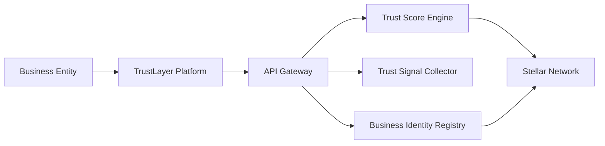
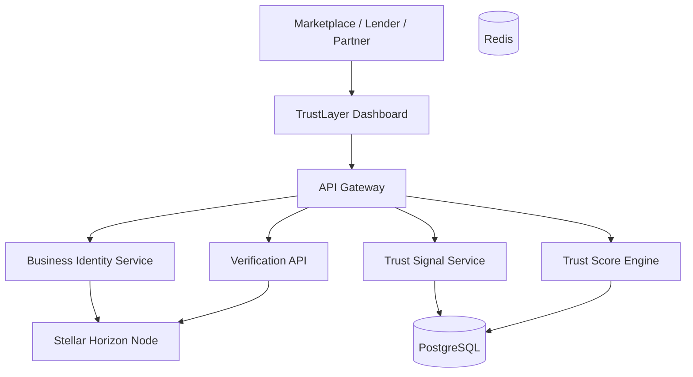

# TrustLayer  
### Business Trust

TrustLayer is a decentralized **business trust scoring protocol built on the Stellar network** that enables companies to establish verifiable credibility in global commerce.

The protocol aggregates **verifiable trust signals** such as payment history, contract fulfillment, trade volume, and partner relationships to compute a transparent **business trust score**.

These trust scores help marketplaces, lenders, suppliers, and partners determine the reliability of a business without relying on centralized rating platforms.

TrustLayer acts as a **global trust infrastructure for businesses**, enabling secure cross-border commerce.

---

# 1. Problem

In global commerce, businesses frequently need to assess whether a counterparty is trustworthy.

Examples include:

- exporters trading internationally
- suppliers working with new buyers
- online merchants accepting large orders
- freelancers or agencies entering contracts

Today, trust evaluation relies on:

| Current Method | Limitation |
|---------------|------------|
| Centralized ratings | controlled by platforms |
| Bank references | slow and limited |
| Manual verification | inefficient |
| Reputation locked in platforms | not portable |

This creates **friction in cross-border trade**, especially for small and medium-sized businesses.

Without reliable trust infrastructure:

- transactions are delayed
- trade risks increase
- financing becomes harder

---

# 2. Solution

TrustLayer introduces a **decentralized trust scoring protocol** where businesses accumulate verifiable trust signals over time.

Each business has a **Trust Profile** that aggregates signals such as:

- payment settlements
- contract completion records
- partner verifications
- reputation ratings
- transaction volumes

These signals are used to compute a **Trust Score**, which represents the reliability of a business.

### Example Trust Record

- Business: Alpha Logistics
- Payments Completed: 128
- Disputes: 0
- Average Rating: 4.7
- Trade Volume: $2.4M

This trust record is cryptographically verifiable and accessible globally.

---

# 3. Key Features

### Verifiable Trust Signals

Businesses accumulate trust signals from verified transactions.

### Decentralized Reputation

Reputation data is portable across platforms.

### Trust Score Computation

Algorithms calculate trust scores based on historical activity.

### Global Business Identity

Each business has a unique identity linked to its trust profile.

### Transparent Trust Records

Partners can independently verify trust credentials.

---

# 4. Why Stellar

TrustLayer leverages the capabilities of the Stellar blockchain.

| Feature | Benefit |
|---------|---------|
| Low transaction costs | affordable credential issuance |
| Fast settlement | real-time trust updates |
| Asset issuance | trust credentials as digital assets |
| Global accessibility | cross-border trust verification |

Stellar enables **efficient and scalable reputation infrastructure**.

---

# 5. System Architecture

---

# 6. Component Architecture

---

# 7. Trust Signal Collection Flow

Trust signals may include payment confirmations, contract completions, and verified partnerships.

1. Business → Platform: Submit Transaction Evidence
2. Platform → SignalEngine: Validate Signal
3. SignalEngine → Stellar: Record Trust Signal
4. Stellar → Platform: Confirmation

---

# 8. Trust Verification Flow

External systems can query the TrustLayer API to verify business credibility.

Verifier → API → Blockchain (Stellar) → Trust Record → API → Verifier

---

# 9. Trust Score Calculation

The trust score is calculated based on multiple factors.

| Factor | Weight |
|--------|--------|
| Payment history | 35% |
| Contract fulfillment | 25% |
| Partner verification | 20% |
| Reputation ratings | 15% |
| Dispute history | 5% |

These signals combine to generate a dynamic trust score.

---

# 10. Data Model

- **BUSINESS**: id, wallet, company_name, country
- **TRUST_SIGNAL**: id, business_id, signal_type, value
- **TRUST_SCORE**: id, business_id, score
- **VERIFICATION**: id, verifier, business_id

BUSINESS generates TRUST_SIGNAL; BUSINESS has TRUST_SCORE; BUSINESS verified_by VERIFICATION.

---

# 11. Smart Contract Logic

Smart contracts manage trust credential issuance and verification.

Core functions:

- `register_business(wallet, company_name)`
- `record_signal(business_id, signal_type, value)`
- `update_trust_score(business_id)`
- `verify_trust_score(business_id)`

These contracts ensure trust data remains immutable and verifiable.

---

# 12. Tech Stack

| Layer | Technologies |
|-------|---------------|
| Frontend | Next.js, React, TailwindCSS, Stellar wallet integration |
| Backend | Golang / Node.js, REST APIs, gRPC microservices |
| Blockchain | Stellar Network, Stellar SDK, Horizon API |
| Infrastructure | Docker, Kubernetes, PostgreSQL, Redis, AWS / GCP |
| Data Processing | Trust signal aggregation, reputation scoring algorithms, real-time trust updates |

---

# 13. Security Considerations

| Layer | Protection |
|-------|------------|
| Cryptographic signatures | Verifies trust signals |
| Identity verification | Prevents impersonation |
| Signal validation | Prevents fraudulent signals |
| Audit trails | Transparent trust history |

---

# 14. Revenue Model

| Revenue Stream | Fee |
|----------------|-----|
| Trust verification API | Usage-based |
| Enterprise integrations | Subscription |
| Business reputation reports | Premium service |
| Marketplace integrations | Licensing |

---

# 15. Future Roadmap

- **Phase 1**: Business identity registry, trust signal collection, basic trust scoring
- **Phase 2**: Enterprise verification APIs, marketplace integrations, advanced scoring models
- **Phase 3**: Global business trust graph, automated trade risk scoring, decentralized reputation marketplaces

---

# 16. Potential Impact

TrustLayer enables trustless global commerce by providing transparent and verifiable business credibility.

Benefits:

- Reduced fraud in global trade
- Improved supplier discovery
- Faster financing decisions
- Enhanced trust between partners

TrustLayer has the potential to become a global trust infrastructure for digital commerce.

---

# Repository Structure

- **[trustlayer-contracts](./trustlayer-contracts)** – Soroban smart contracts (Rust) for trust credential issuance and verification
- **[trustlayer-backend](./trustlayer-backend)** – API gateway, identity/signal/score services (Node.js/Express)
- **[trustlayer-frontend](./trustlayer-frontend)** – TrustLayer dashboard and Stellar wallet integration (Next.js)

See each folder’s README for setup and contribution instructions.

---

**License:** MIT
